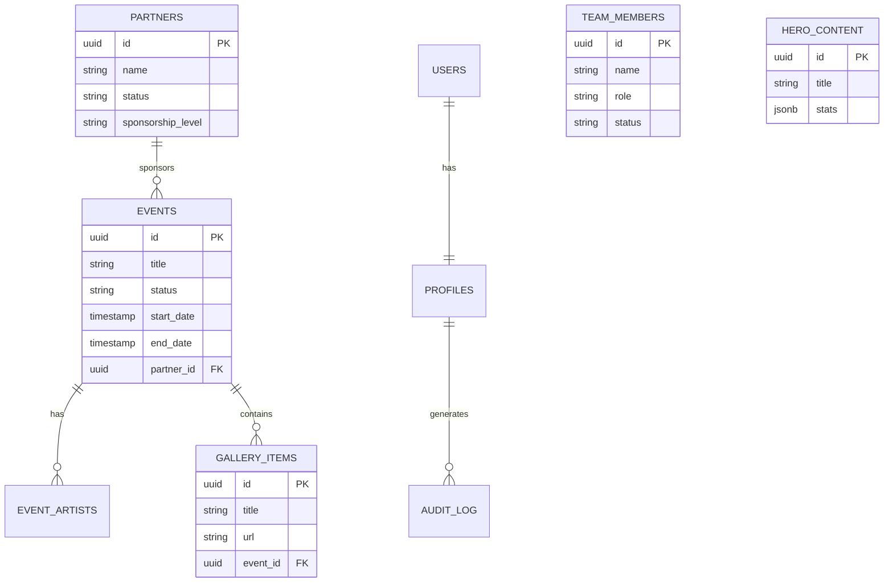
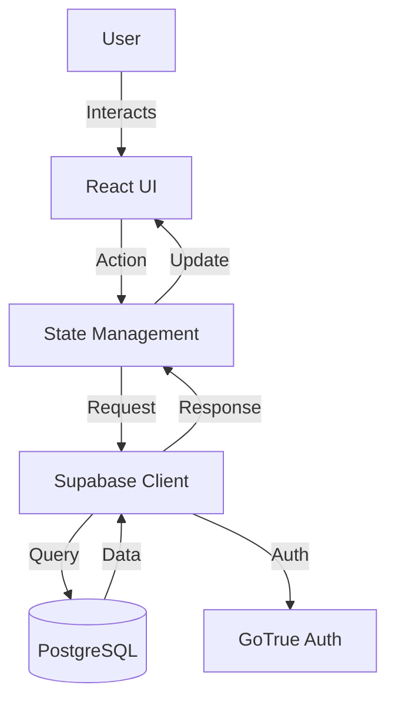

<!-- OPENSPEC:START -->
# OpenSpec Instructions

These instructions are for AI assistants working in this project.

Always open `@/openspec/AGENTS.md` when the request:
- Mentions planning or proposals (words like proposal, spec, change, plan)
- Introduces new capabilities, breaking changes, architecture shifts, or big performance/security work
- Sounds ambiguous and you need the authoritative spec before coding

Use `@/openspec/AGENTS.md` to learn:
- How to create and apply change proposals
- Spec format and conventions
- Project structure and guidelines

Keep this managed block so 'openspec update' can refresh the instructions.

<!-- OPENSPEC:END -->

# Product Requirements Document (PRD)

## Project Overview
WildOut! is a media digital nightlife and event multi-platform connecting artists, events, and experiences. The platform requires a robust, scalable, and secure architecture to handle 500+ events, 50K+ members, and 100+ partners.

## Core Features
1.  **Event Management**: CRUD operations for events, including artist lineups, ticketing, and gallery integration.
2.  **Partner Management**: Management of sponsors and partners with tiered visibility.
3.  **Team Management**: Display and management of internal team members.
4.  **Content Management**: Admin control over Hero, About, and Site Settings sections.
5.  **Authentication**: Secure role-based access (Admin, Editor, Member) via Supabase Auth.

## System Architecture
*   **Frontend**: React, TypeScript, Tailwind CSS, Shadcn UI.
*   **Backend**: Supabase (PostgreSQL, Auth, Storage, Edge Functions).
*   **State Management**: React Context (migrating to TanStack Query).
*   **Routing**: Custom Router (migrating to React Router or TanStack Router recommended).

## Entity-Relationship Diagram (ERD)

## System Flow

## Development Protocols

### Do's
*   **DO** use the generated Supabase types for all database interactions.
*   **DO** use `openspec` for any architectural changes or new features.
*   **DO** use `codebase_search` before asking for context.
*   **DO** implement RLS policies for every new table.
*   **DO** ALWAYS use MCP server **"supabase"** for ALL database (DB) and storage operations via MCP Supabase tools (mcp_supabase-dg-ocr).

### Don'ts
*   **DON'T** modify `AGENTS.md` or `openspec` files directly without a proposal.
*   **DON'T** use `any` type unless absolutely necessary and documented.
*   **DON'T** hardcode secrets; use environment variables.
*   **DON'T** run local Supabase commands (`supabase start`, `db reset`, `db pull`, etc.) unless EXPLICITLY instructed by user.