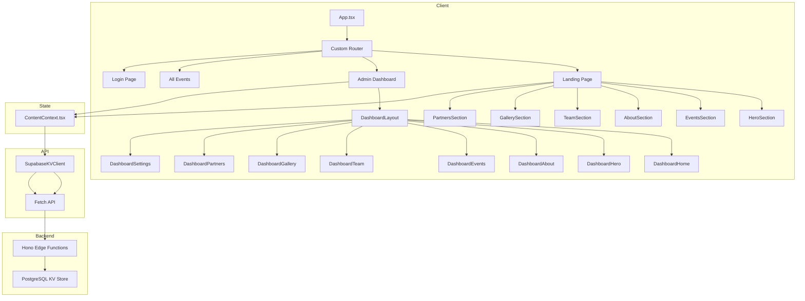

# WildOut! Project - Full Code Review Report

**Review Date:** January 6, 2026  
**Reviewer:** Architect Mode Analysis  
**Project Version:** 0.1.0  
**Tech Stack:** React 19 + TypeScript + Vite + Supabase + Tailwind + Radix UI

---

## Executive Summary

The WildOut! project is a well-structured, modern React application with a dual-interface system (public landing page + admin dashboard). The codebase demonstrates solid architectural decisions, consistent coding patterns, and good separation of concerns. However, several technical debt items and security concerns require attention before production deployment.

**Overall Assessment:** **B+ (Good with Improvements Needed)**

---

## 1. Architecture Review

### 1.1 Project Structure
```
src/
├── components/
│   ├── ui/              # shadcn/ui components (40+)
│   ├── dashboard/       # Admin panel components
│   └── [feature]/       # Feature components
├── contexts/            # React contexts (ContentContext)
├── lib/                 # Utilities (Supabase client)
├── supabase/
│   ├── api/client.ts    # Typed API client (SupabaseKVClient)
│   └── functions/server/ # Edge Functions (Hono)
├── types/               # TypeScript types & Zod schemas
└── utils/               # Helper functions
```

**Strengths:**
- Clean separation between UI components and business logic
- Consistent use of React.memo() for performance optimization
- Well-organized dashboard components with reusable patterns
- Proper use of TypeScript strict mode

**Areas for Improvement:**
- Duplicate API layer: [`src/supabase/api.ts`](src/supabase/api.ts:1) is deprecated but still exists
- Schema duplication between [`src/types/schemas.ts`](src/types/schemas.ts:1) and [`src/supabase/functions/server/schemas.ts`](src/supabase/functions/server/schemas.ts:1)

### 1.2 Routing Architecture
**Current Implementation:** Custom client-side router in [`src/components/Router.tsx`](src/components/Router.tsx:1)

**Concerns:**
- Custom router lacks support for dynamic routes (`/events/:id`)
- No built-in route guards for protected admin pages
- Limited query parameter handling

**Recommendation:** Consider migrating to TanStack Router or React Router for better scalability (as noted in ROADMAP.md)

### 1.3 State Management
**Current Pattern:** React Context (ContentContext) + useState

**Implementation:** [`src/contexts/ContentContext.tsx`](src/contexts/ContentContext.tsx:1)

**Strengths:**
- Centralized data management with fallback initial data
- Proper error handling with graceful degradation
- Optimistic UI updates with API sync

**Concerns:**
- Large context with multiple responsibilities
- No pagination for large datasets
- Single refresh function fetches all data (potential performance issue)

---

## 2. Security Review

### 2.1 Critical Issues

#### 2.1.1 Hardcoded Credentials
**File:** [`src/lib/supabase.ts`](src/lib/supabase.ts:1:5-6)

```typescript
const SUPABASE_URL = import.meta.env.VITE_SUPABASE_URL || "https://yanjivicgslwutjzhzdx.supabase.co";
const SUPABASE_ANON_KEY = import.meta.env.VITE_SUPABASE_ANON_KEY || "eyJhbGciOiJIUzI1NiIsInR5cCI6IkpXVCJ9...";
```

**Risk Level:** **HIGH**

**Impact:**
- Development credentials exposed in production code
- Anyone can extract these keys and access Supabase project
- Potential data breach if service role keys are compromised

**Recommendation:**
```typescript
const SUPABASE_URL = import.meta.env.VITE_SUPABASE_URL;
const SUPABASE_ANON_KEY = import.meta.env.VITE_SUPABASE_ANON_KEY;

if (!SUPABASE_URL || !SUPABASE_ANON_KEY) {
  throw new Error("Missing required environment variables: VITE_SUPABASE_URL, VITE_SUPABASE_ANON_KEY");
}
```

#### 2.1.2 Deprecated API with Different Credentials
**File:** [`src/supabase/api.ts`](src/supabase/api.ts:1:3-4)

```typescript
const SUPABASE_URL = 'https://ufbwljfoejurcbndnalo.supabase.co';
```

**Risk Level:** **MEDIUM**

**Impact:**
- Duplicate Supabase URL pointing to different project
- Dead code with potentially different credentials
- Confusion during debugging and maintenance

**Recommendation:** Delete this file immediately

#### 2.1.3 CORS Configuration
**File:** [`src/supabase/functions/server/index.tsx`](src/supabase/functions/server/index.tsx:1:30-38)

```typescript
cors({
  origin: "*",  // Allow all origins
  allowHeaders: ["Content-Type", "Authorization"],
  allowMethods: ["GET", "POST", "PUT", "DELETE", "OPTIONS"],
  ...
})
```

**Risk Level:** **MEDIUM**

**Impact:**
- Open CORS allows any domain to make requests
- Combined with exposed credentials, enables potential abuse

**Recommendation:** Restrict to specific origins:
```typescript
cors({
  origin: ["https://wildoutproject.com", "http://localhost:3000"],
  ...
})
```

### 2.2 Authentication & Authorization

**Current Implementation:**
- JWT-based auth via Supabase Auth
- Auth middleware on write operations only
- [`src/supabase/functions/server/index.tsx`](src/supabase/functions/server/index.tsx:1:42-57)

**Strengths:**
- write_to_file operations protected by auth middleware
- Token validation on each protected request

**Concerns:**
- GET endpoints are publicly accessible (acceptable for content)
- No rate limiting implementation
- No audit logging for admin actions

---

## 3. Code Quality Review

### 3.1 TypeScript & Types

**Assessment:** **Good** with minor issues

**Strengths:**
- Strict mode enabled
- Zod schemas for runtime validation
- Shared types between client and server

**Issues Found:**
1. **Type Duplication:** Internal UI types in [`ContentContext.tsx`](src/contexts/ContentContext.tsx:1:7-92) duplicate schema types
   - `Event`, `Partner`, `GalleryImage`, `TeamMember` interfaces defined separately
   - Should use imported types from `../types/schemas`

2. **Missing Validation:** Some form inputs lack proper validation
   - [`DashboardEvents.tsx`](src/components/dashboard/DashboardEvents.tsx:1:78-89) uses `confirm()` for destructive operations
   - Should use AlertDialog for better UX and accessibility

### 3.2 Component Patterns

**Assessment:** **Excellent**

**Strengths:**
- Consistent use of React.memo() with displayName
- Proper use of hooks (useState, useCallback, useEffect)
- Lucide icons for consistent iconography
- Motion animations for smooth transitions

**Example Pattern (DashboardHero):**
```typescript
export const DashboardHero = React.memo(() => {
  // Component logic
});
DashboardHero.displayName = 'DashboardHero';
```

### 3.3 API Client

**File:** [`src/supabase/api/client.ts`](src/supabase/api/client.ts:1)

**Assessment:** **Good** with issues

**Strengths:**
- Proper error handling with timeout (5s)
- Zod schema validation on responses
- Auth header injection
- Console logging for debugging

**Concerns:**
1. **Verbose Logging:** Excessive console.log in production code
   - Lines 41, 68, 78, 120, 538 in ContentContext
   - Should use proper logging library or environment-based logging

2. **Missing Error Recovery:**
   - No retry logic for failed requests
   - No circuit breaker pattern

### 3.4 Edge Functions

**File:** [`src/supabase/functions/server/index.tsx`](src/supabase/functions/server/index.tsx:1)

**Assessment:** **Good**

**Strengths:**
- Proper use of Hono framework
- Zod validation on all inputs
- 60s cache control for GET requests
- Auth middleware for write operations

**Concerns:**
1. **Missing PUT for Team & Gallery:**
   - Team: No PUT endpoint (only POST, DELETE)
   - Gallery: No PUT endpoint (only POST, DELETE)
   - Inconsistent with other entities

2. **Error Handling:**
   - Generic error messages
   - No structured error response format

---

## 4. Performance Review

### 4.1 Frontend Performance

**Assessment:** **Good**

**Strengths:**
- React 19 with concurrent features
- Component memoization
- Lazy loading through dynamic imports (not implemented but possible)

**Concerns:**
1. **Large Bundle Size:**
   - 40+ shadcn/ui components included
   - Motion library adds significant size
   - Consider tree-shaking or code-splitting

2. **Data Fetching:**
   - [`ContentContext.tsx`](src/contexts/ContentContext.tsx:1:455-525) fetches all data on mount
   - No pagination for large datasets
   - No client-side caching beyond context

### 4.2 Backend Performance

**Assessment:** **Good**

**Strengths:**
- 60s cache control for GET requests
- PostgreSQL-backed KV store with proper indexing

**Concerns:**
1. **Query Patterns:**
   - `getByPrefix` uses LIKE query (potentially slow at scale)
   - No database indexes on value column

2. **No Request Batching:**
   - Multiple API calls for different data types
   - Could benefit from GraphQL or batch endpoint

---

## 5. UI/UX Review

### 5.1 Design System

**Assessment:** **Good**

**Strengths:**
- Consistent color scheme (primary: #E93370)
- Dark mode by default
- Responsive design with Tailwind CSS
- Smooth animations with Motion

**Concerns:**
1. **Inconsistent Component Styling:**
   - Some components use inline styles mixed with Tailwind
   - Manual color values instead of CSS variables

2. **Accessibility:**
   - Missing ARIA labels on some interactive elements
   - No keyboard navigation for custom components
   - Focus states not consistent

### 5.2 Dashboard UX

**Assessment:** **Good**

**Strengths:**
- Clear navigation with icons
- Loading states with spinners
- Toast notifications for feedback
- Form validation with error messages

**Concerns:**
1. **Image Upload UX:**
   - File upload converts to Base64 (not scalable)
   - No progress indicator
   - No image compression

2. **Bulk Operations:**
   - No bulk delete for events/partners
   - No select-all functionality

---

## 6. Testing Review

### 6.1 Current Coverage

**Assessment:** **Limited**

**Existing Tests:**
- Zod schema tests: [`src/types/schemas.test.ts`](src/types/schemas.test.ts:1)

**Missing Tests:**
- No unit tests for ContentContext
- No integration tests for API client
- No component tests
- No E2E tests

### 6.2 Recommendations

1. Add unit tests for ContentContext using @testing-library/react
2. Add API integration tests with mocked fetch
3. Add component tests for critical paths
4. Add E2E tests for admin workflows

---

## 7. Issue Summary

### Critical (Fix Immediately)
| # | Issue | File | Priority |
|---|-------|------|----------|
| 1 | Hardcoded Supabase credentials | [`src/lib/supabase.ts`](src/lib/supabase.ts:1) | P0 |
| 2 | Deprecated API file with different credentials | [`src/supabase/api.ts`](src/supabase/api.ts:1) | P0 |
| 3 | Open CORS configuration | [`src/supabase/functions/server/index.tsx`](src/supabase/functions/server/index.tsx:1) | P1 |

### High (Fix Before Production)
| # | Issue | File | Priority |
|---|-------|------|----------|
| 4 | Missing PUT endpoints for Team & Gallery | [`src/supabase/functions/server/index.tsx`](src/supabase/functions/server/index.tsx:1) | P1 |
| 5 | No route protection for admin pages | [`src/components/Router.tsx`](src/components/Router.tsx:1) | P1 |
| 6 | Type duplication between schemas and context | [`src/contexts/ContentContext.tsx`](src/contexts/ContentContext.tsx:1) | P2 |

### Medium (Improve Before/After Launch)
| # | Issue | File | Priority |
|---|-------|------|----------|
| 7 | Excessive console logging | Multiple files | P2 |
| 8 | No pagination for large datasets | [`src/contexts/ContentContext.tsx`](src/contexts/ContentContext.tsx:1) | P2 |
| 9 | Base64 image upload (not scalable) | [`src/components/dashboard/ImageUpload.tsx`](src/components/dashboard/ImageUpload.tsx:1) | P2 |
| 10 | Missing audit logging | N/A | P3 |

### Low (Nice to Have)
| # | Issue | File | Priority |
|---|-------|------|----------|
| 11 | Consider TanStack Router migration | [`src/components/Router.tsx`](src/components/Router.tsx:1) | P3 |
| 12 | Add loading skeletons | Multiple components | P3 |
| 13 | Implement retry logic for API calls | [`src/supabase/api/client.ts`](src/supabase/api/client.ts:1) | P3 |
| 14 | Add rate limiting to Edge Functions | [`src/supabase/functions/server/index.tsx`](src/supabase/functions/server/index.tsx:1) | P3 |

---

## 8. Roadmap Alignment

The existing [`docs/ROADMAP.md`](docs/ROADMAP.md:1) outlines a sensible phased approach:

### Phase 1: Code Consolidation & Environment Safety ✅
- **Status:** Not started
- **Tasks:**
  - [ ] Consolidate API clients (delete `src/supabase/api.ts`)
  - [ ] Harden environment configuration

### Phase 2: Testing & Quality Assurance 📋
- **Status:** Not started
- **Tasks:**
  - [ ] UI & State testing (ContentContext)
  - [ ] API integration testing
  - [ ] Edge Function testing

### Phase 3: Architectural Enhancements 📋
- **Status:** Not started
- **Tasks:**
  - [ ] Routing upgrade (TanStack Router)
  - [ ] Advanced caching (React Query)

### Phase 4: Feature Expansion (Optional) 📋
- **Status:** Not started
- **Tasks:**
  - [ ] Image optimization service
  - [ ] Activity logs

---

## 9. Recommendations Summary

### Immediate Actions (Before Next Deployment)

1. **Remove hardcoded credentials** from `src/lib/supabase.ts`
2. **Delete deprecated API file** `src/supabase/api.ts`
3. **Restrict CORS** to specific origins
4. **Add route protection** for admin pages
5. **Implement PUT endpoints** for Team and Gallery

### Short-Term Improvements (This Sprint)

6. **Consolidate type definitions** - Use shared schema types
7. **Add proper delete confirmation** - Replace `confirm()` with AlertDialog
8. **Improve error handling** - Structured error responses
9. **Add loading states** - Skeleton components for better UX
10. **Implement audit logging** - Track admin changes

### Long-Term Enhancements (Next Quarter)

11. **Migrate to TanStack Router** - Better routing capabilities
12. **Add React Query** - Advanced caching and state management
13. **Implement pagination** - For large datasets
14. **Add image upload service** - Replace Base64 with cloud storage
15. **Add comprehensive tests** - Unit, integration, E2E

---

## 10. Files Reviewed

| Category | Files | Count |
|----------|-------|-------|
| Core | App.tsx, main.tsx, Router.tsx | 3 |
| Contexts | ContentContext.tsx | 1 |
| API | api.ts, api/client.ts, functions/server/* | 4 |
| Types | schemas.ts, supabase.ts | 2 |
| Landing | LandingPage.tsx, *Section.tsx (6 files) | 7 |
| Dashboard | Dashboard.tsx, DashboardLayout.tsx, * (6 files) | 8 |
| UI Components | ui/* | 40+ |
| Utils | supabase/info.tsx | 1 |
| Config | package.json, tsconfig.json, vite.config.ts | 3 |
| Docs | PROJECT_REVIEW.md, ROADMAP.md, AGENTS.md, CLAUDE.md | 4 |

**Total Files Reviewed:** 80+

---

## Appendix A: Mermaid Architecture Diagram



---

## Appendix B: Environment Variables Required

```bash
VITE_SUPABASE_URL=your-project-url
VITE_SUPABASE_ANON_KEY=your-anon-key
```

---

**Report Generated:** January 6, 2026  
**Next Review:** Before production deployment or major feature release
