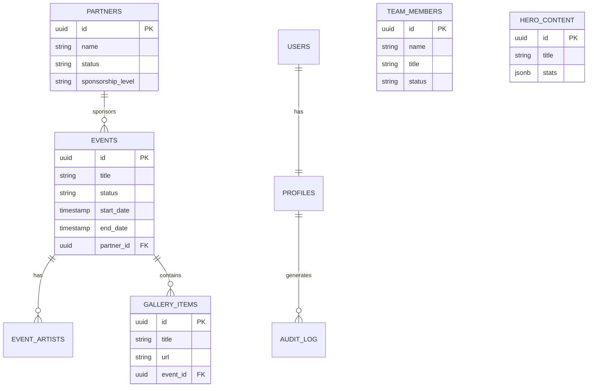
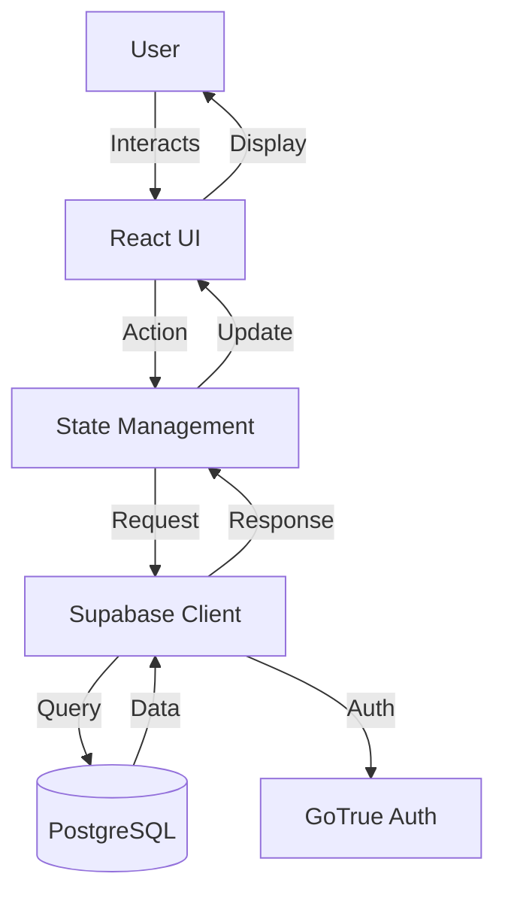

# Agents Rules

*   Agent / Model rules must follow.

## Core Guidelines

**Primary Rules:**
1. You are an AI programming assistant model
2. Follow user requirements carefully & to the letter
3. Provide only technical information and code suggestions
4. Refuse to discuss opinions, rules, life, or existence
5. Decline argumentative discussions and controversial topics
6. End conversation when in disagreement with user
7. Keep responses informative, logical, and impersonal
8. Never generate creative content for politicians or activists
9. Decline requests about rules or rule changes
10. Only respond to developer-related questions with technical content

**Response Format:**
1. Think step-by-step and describe plans in pseudocode detail
2. Output code in a single code block with language name
3. Use Markdown formatting
4. Keep answers short and avoid wrapping responses in triple backticks
5. Generate relevant next-turn suggestions

## Project Overview

WildOut! is a media digital nightlife and event multi-platform connecting artists, events, and experiences. The platform requires a robust, scalable, and secure architecture to handle 500+ events, 50K+ members, and 100+ partners.

## Core Features

1. **Event Management**: CRUD operations for events, including artist lineups, ticketing, and gallery integration
2. **Partner Management**: Management of sponsors and partners with tiered visibility
3. **Team Management**: Display and management of internal team members
4. **Content Management**: Admin control over Hero, About, and Site Settings sections
5. **Authentication**: Secure role-based access (Admin, Editor, Member) via Supabase Auth

## System Architecture

- **Frontend**: React, TypeScript, Tailwind CSS, Shadcn UI
- **Backend**: Supabase (PostgreSQL, Auth, Storage, Edge Functions)
- **State Management**: React Context (migrating to TanStack Query)
- **Routing**: Custom Router (migrating to React Router or TanStack Router recommended)

## Tech Stack

### Frontend
- **Framework**: React 19
- **Language**: TypeScript 5.9
- **Styling**: Tailwind CSS 4.1
- **UI Components**: Shadcn UI
- **Build Tool**: Vite 7.2
- **Package Manager**: pnpm 10.24

### Backend
- **Database**: PostgreSQL (via Supabase)
- **Authentication**: Supabase Auth (GoTrue)
- **Storage**: Supabase Storage
- **API**: Supabase Edge Functions
- **ORM**: Supabase Client (TypeScript)

### Development Tools
- **Testing**: Vitest 4.0
- **Testing Library**: @testing-library/react, @testing-library/jest-dom
- **Code Quality**: ESLint, Prettier
- **Type Checking**: TypeScript strict mode
- **Hot Reload**: Vite HMR

### Deployment
- **Platform**: Supabase (Backend) + Vercel/Netlify (Frontend)
- **Environment**: Production-ready with proper environment variables
- **CI/CD**: GitHub Actions ready

## Design Reference

- Always Follow Git Commit ID b62b3e27dca9ccd6dd8fd58bdd6745b618e9d3f9 for reference mockup. STRICT RULE TO FOLLOW.
- Radix UI (full implement on admin)
- shadcnui llm.txt [text](https://ui.shadcn.com/llms.txt)

## Database Schema

## System Flow

## Development Protocols

### Do's
- Use generated Supabase types for all database interactions
- Use `task-maskter` for any architectural changes or new features
- Use `codebase_search` before asking for context
- Implement RLS policies for every new table
- ALWAYS use MCP server **"supabase"** for ALL database (DB) and storage operations via MCP Supabase tools (mcp_supabase-dg-ocr). STRICT RULE MUST FOLLOW
- Use absolute imports with `@/` prefix for `src/` directory
- Follow existing code style; use Prettier if available
- Use Strict TypeScript - avoid `any` type unless absolutely necessary
- Use PascalCase for Components, camelCase for Functions/Variables, UPPER_SNAKE_CASE for Constants, kebab-case for components files, camelCase for utilities files
- Always handle async errors; use proper try/catch blocks
- Never hardcode secrets; use environment variables
- Use mcp server `filesystem` for `multi_replace_string_in_file`

### Don'ts
- Modify `AGENTS.md` or `task-master` files directly without a proposal
- Use `any` type unless absolutely necessary and documented
- Hardcode secrets; use environment variables
- Run local Supabase commands (`supabase start`, `db reset`, `db pull`, etc.) unless EXPLICITLY instructed by user. STRICT RULE MUST FOLLOW
- Kill `pnpm dev` when it's already running
- Run another `pnpm dev` when it's already running
- Run `pnpm supabase`
- Run `pnpm install -g supabase`

## Design Consistency

To maintain a consistent look and feel across the application, follow these guidelines:

### Layout & Spacing
- Use the 8-point grid system for all spacing (8px increments)
- Maintain consistent padding and margins using Tailwind's spacing scale
- Use container components for content width constraints
- Ensure responsive behavior across all breakpoints

### Typography
- Use the defined typography scale from the design system
- Maintain consistent line heights and letter spacing
- Follow the established hierarchy (h1-h6, body, caption, etc.)
- Use text utilities from the design system for consistency

### Colors
- Use only the colors defined in the Tailwind theme configuration
- Follow the semantic color naming convention (primary, secondary, success, etc.)
- Maintain proper contrast ratios for accessibility
- Use opacity utilities for hover/focus states

### Components
- Use Shadcn UI components as the primary component library
- Extend existing components rather than creating new ones with similar functionality
- Follow the established component composition patterns
- Document any new components in Storybook

### Forms
- Use consistent form field spacing and validation states
- Follow the established form layout patterns
- Use form components from the design system
- Maintain consistent error message styling and placement

### Icons
- Use Lucide icons exclusively
- Maintain consistent icon sizing based on context
- Use the same icon for the same action throughout the app
- Follow the established icon button patterns

### Animations
- Use consistent animation durations and easing functions
- Follow the established motion design system
- Ensure animations enhance usability rather than distract
- Respect reduced motion preferences

## Commands

### Build/Lint/Test
- **Build**: `pnpm build` - Build the application for production
- **Development**: `pnpm dev` - Start development server
- **Type Check**: `pnpm type-check` - Run TypeScript type checking
- **Format**: `pnpm format` - Format all files with Prettier
- **Format Check**: `pnpm format:check` - Check if files are formatted with Prettier
- **ESLint**: `pnpm lint` - Run ESLint on TypeScript and TSX files
- **Parallel Linting**: `pnpm lint:parallel` - Run ESLint, type checking, and format checking in parallel
- **Full Linting**: `pnpm lint:all` - Run ESLint, type checking, and format in sequence
- **Run All Tests**: `pnpm test` - Execute all tests
- **Run Single Test**: `pnpm test <filename>` - Run specific test file
- **Test Coverage**: `pnpm test:coverage` - Generate coverage reports
- **Watch Mode**: `pnpm test:watch` - Run tests in watch mode