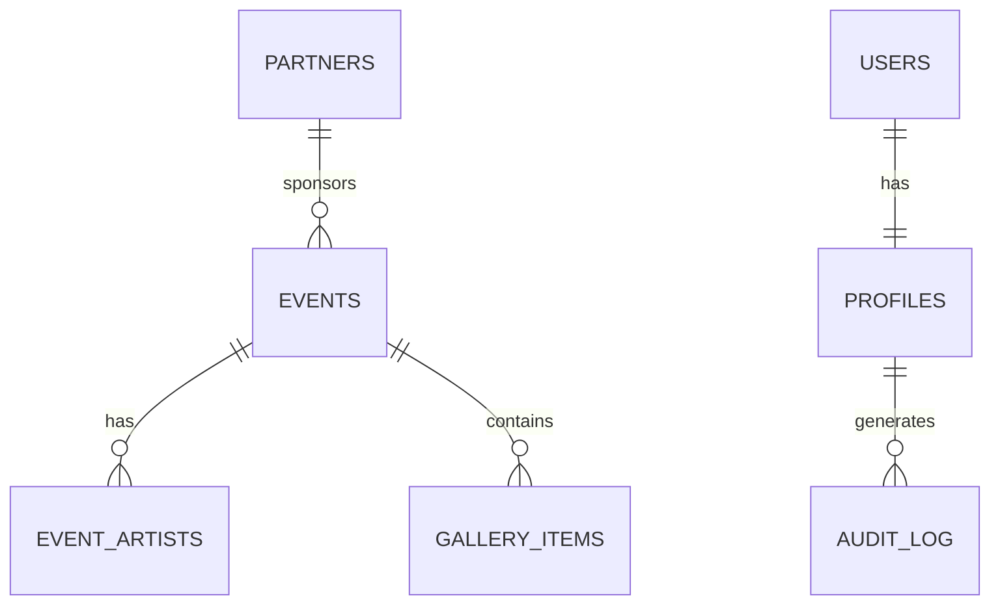

# src/supabase/ - Database Integration

**Detailed guidance for Supabase database integration**

## Package Identity

- **Purpose**: Supabase database client and type definitions
- **Primary Tech**: Supabase JavaScript client, TypeScript 5.9
- **Database**: PostgreSQL with Supabase extensions

## Setup & Run

```bash
# No special setup needed - Supabase client is configured
# Generate types from database
pnpm supabase gen types typescript --project-id "your-project-id" > src/supabase/types.ts
```

## Patterns & Conventions

### File Organization Rules

- **Client**: `src/supabase/client.ts` - Supabase client configuration
- **Types**: `src/supabase/types.ts` - Generated TypeScript types
- **Functions**: `src/supabase/functions/` - Edge functions (if any)

### Naming Conventions

- **Client Instance**: `supabase` (default export)
- **Type Interfaces**: TableName + "Row" (e.g., `EventsRow`, `UsersRow`)
- **Query Functions**: TableName + "Query" (e.g., `eventsQuery`, `usersQuery`)

### Preferred Patterns

✅ **DO**: Use the configured Supabase client

```typescript
// Example: src/supabase/client.ts
import { createClient } from "@supabase/supabase-js";

const supabaseUrl = import.meta.env.VITE_SUPABASE_URL;
const supabaseKey = import.meta.env.VITE_SUPABASE_ANON_KEY;

if (!supabaseUrl || !supabaseKey) {
  throw new Error("Supabase URL and/or Anon Key are missing!");
}

export const supabase = createClient(supabaseUrl, supabaseKey);
```

✅ **DO**: Use generated types for all database operations

```typescript
// Example: Using generated types
import { supabase } from "@/supabase/client";
import type { Database } from "@/supabase/types";

type Event = Database["public"]["Tables"]["events"]["Row"];

async function fetchEvents() {
  const { data, error } = await supabase
    .from("events")
    .select("*")
    .order("start_date", { ascending: true });

  if (error) throw error;
  return data as Event[];
}
```

✅ **DO**: Handle errors properly in database operations

```typescript
// Example: Error handling in Supabase queries
async function createEvent(eventData: Omit<Event, "id">) {
  try {
    const { data, error } = await supabase
      .from("events")
      .insert(eventData)
      .select()
      .single();

    if (error) {
      console.error("Error creating event:", error);
      throw error;
    }

    return data as Event;
  } catch (error) {
    console.error("Database operation failed:", error);
    throw error;
  }
}
```

✅ **DO**: Use RLS (Row-Level Security) policies

```typescript
// Example: Query with RLS
const { data, error } = await supabase
  .from("events")
  .select("*")
  .eq("user_id", currentUser.id); // RLS policy will enforce this
```

✅ **DO**: Use transactions for multiple operations

```typescript
// Example: Transaction pattern
async function createEventWithArtists(eventData: Event, artistIds: string[]) {
  const { data: event, error: eventError } = await supabase
    .from("events")
    .insert(eventData)
    .select()
    .single();

  if (eventError) throw eventError;

  const eventArtists = artistIds.map((artistId) => ({
    event_id: event.id,
    artist_id: artistId,
  }));

  const { error: artistsError } = await supabase
    .from("event_artists")
    .insert(eventArtists);

  if (artistsError) {
    // Rollback: delete the event if artists fail
    await supabase.from("events").delete().eq("id", event.id);
    throw artistsError;
  }

  return event;
}
```

❌ **DON'T**: Hardcode database URLs or keys

```typescript
// Avoid: Hardcoded Supabase credentials
const supabase = createClient(
  "https://hardcoded-url.supabase.co",
  "hardcoded-anon-key"
); // ❌ Never do this
```

❌ **DON'T**: Use `any` type for database operations

```typescript
// Avoid: Untyped database operations
const { data } = await supabase.from("events").select("*"); // ❌ No type safety
```

## Touch Points / Key Files

- **Supabase Client**: `src/supabase/client.ts` - Main client configuration
- **Type Definitions**: `src/supabase/types.ts` - Generated database types
- **Environment Variables**: `.env` and `.env.example` - Configuration

## JIT Index Hints

```bash
# Find Supabase client usage
rg -n "supabase\." src/

# Find database queries
rg -n "from\('.*'\)" src/

# Find specific table operations
rg -n "from\('events'\)" src/

# Find RLS policy usage
rg -n "\.eq\('user_id'" src/

# Find transaction patterns
rg -n "await.*supabase.*from" src/ | grep -A5 -B5 "await.*supabase"
```

## Common Gotchas

- **Environment Variables**: Always use `.env` files, never hardcode secrets
- **Type Safety**: Always use generated types for database operations
- **Error Handling**: Always handle errors in async database operations
- **RLS Policies**: Ensure proper Row-Level Security policies are in place
- **Performance**: Use `.select()` to specify only needed columns

## Best Practices

1. **Type Safety**: Always use generated TypeScript types
2. **Error Handling**: Provide proper error handling for all database operations
3. **Security**: Use RLS policies and never bypass them
4. **Performance**: Select only needed columns, use proper indexing
5. **Transactions**: Use transactions for related operations

## Database Schema Reference

The database follows this schema:



## Pre-PR Checks

```bash
# Verify Supabase client configuration
rg -n "VITE_SUPABASE" .env.example && echo "Environment variables configured"

# Check for hardcoded secrets
rg -n "supabase.*createClient.*\"http" src/ && echo "Found hardcoded URLs!" || echo "No hardcoded URLs found"

# Verify type usage
rg -n "Database\['public'\]" src/ && echo "Using generated types" || echo "Check type usage"
```

## Model Cutoff Research

> **Note**: If your model cutoff date is earlier than the current date, you need to conduct research to update your knowledge.
